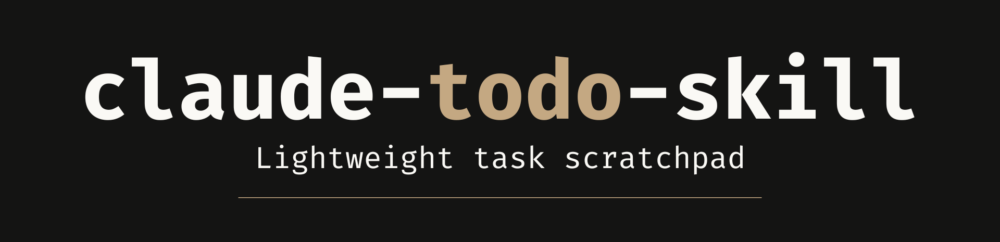

<p align="center">
  
</p>

# claude-todo-skill

> Capture ideas without leaving Claude Code.

  

---

## The Problem

You're deep in a Claude session, something clicks — "oh, I should add dark mode" or "need to write tests for that auth flow" — and you think, I'll remember that. You won't. It's gone by the next session.

You could switch to a notes app, open an issue tracker, or drop it in a Slack message to yourself. But you're mid-thought, mid-flow, and any context switch costs you momentum.

---

## Who This Is For

Developers who think of things mid-session and lose them by the next one. This is the lightest tool in the Code Katz suite — no structure, no categories, no overhead. Just a flat list of things you don't want to forget.

---

## See the Difference

You just realized something needs to happen, but you're in the middle of something else.

**Without the todo skill:**

> **You:** Oh wait, I also need to write tests for that auth module. Let me open a note somewhere...
>
> *(switches to Notes app, writes it down, switches back, loses train of thought)*

**With the todo skill:**

> **You:** /todo write unit tests for the auth module
>
> **Claude:** Added. You now have 3 open items. Back to what we were doing — you were asking about the refresh token rotation.

No context switch. No app to open. The idea is captured and you're still in flow.

---

## Commands

| Command | What happens |
|---|---|
| `/todo <text>` | Appends `- [ ] <text>` to your project's `TODOS.md` |
| `/todo` | Claude asks what you want to add, then adds it |
| `/todos` | Lists all your open (unchecked) items |
| `/todos review` | Walks through each open item interactively |

---

## Your TODOS.md

Lives in your project root — right next to your `DEVLOG.md` and `ROADMAP.md` if you use those. Looks like this:

```markdown
# TODOS
<!-- project: my-cool-project -->

- [ ] write unit tests for the auth module
- [ ] look into dark mode toggle
  - Update 2026-03-20: tried it, needs a theme context refactor first
- [x] add error handling to the API client
```

Flat list. No categories. No due dates. No overhead. Completed items stay right where they are, just checked off. That's intentional — this is a scratchpad, not a project management suite.

---

## Installation

This skill is for [Claude Code](https://claude.ai/code). Install it once and it's available across all your projects:

```bash
mkdir -p ~/.claude/skills/todo
curl -o ~/.claude/skills/todo/SKILL.md \
  https://raw.githubusercontent.com/code-katz/claude-todo-skill/main/SKILL.md
```

---

## Usage

Once installed, the skill activates automatically in Claude Code. You can:

- **Quick capture** — type `/todo` followed by the idea
- **Brain dump review** — type `/todos review` to walk through open items one by one
- **Check status** — type `/todos` to see what's still open
- **Lint check** — on first use per session, verifies your project has a linter configured and flags if missing

---

## Works Well With

| Project | What it does |
|---|---|
| [claude-team-cli](https://github.com/code-katz/claude-team-cli) | Ten specialist personas for Claude Code — capture action items from any specialist session |
| [claude-devlog-skill](https://github.com/code-katz/claude-devlog-skill) | Structured development changelog — the devlog captures decisions, the todo list captures everything else |
| [claude-roadmap-skill](https://github.com/code-katz/claude-roadmap-skill) | Living product roadmap — strategic priorities live in the roadmap, tactical tasks live here |
| [claude-plans-skill](https://github.com/code-katz/claude-plans-skill) | Archives finalized implementation plans — plans capture the approach, todos capture the loose threads |
| [claude-publish-agent](https://github.com/code-katz/claude-publish-agent) | Publish markdown to blogging platforms — write about what you've built and ship it from the terminal |

---

## Repository Contents

| File | Purpose |
|---|---|
| `SKILL.md` | The skill source file — Claude's instructions for how todo capture works |
| `DEVLOG.md` | Development log for this project |
| `README.md` | This file |

---

## License

See [LICENSE](LICENSE) for details.
